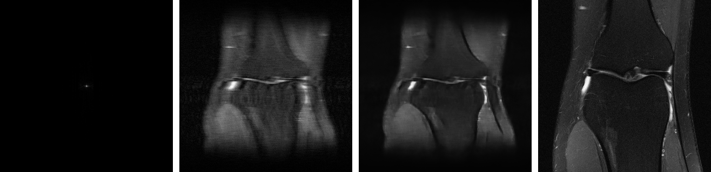

# MRI Edge RTOS AI

An embedded medical-imaging prototype that combines fastMRI reconstruction, ONNX/TensorRT edge deployment, a C++ inference service, and an RTOS-oriented control scaffold.

This repository is designed as an engineering portfolio project. It does not control real MRI hardware, but it follows the software shape of an MRI-style embedded system: deterministic control on an MCU, reconstruction on an edge GPU, explicit service boundaries, documented measurements, and reproducible scripts.

## Highlights

- Trained a lightweight U-Net on fastMRI knee single-coil data with 4x undersampling.
- Exported the PyTorch checkpoint to ONNX with a fixed `1x1x320x320` input shape.
- Built and benchmarked a TensorRT FP16 engine on NVIDIA Jetson Orin.
- Implemented a C++17 inference boundary with a TensorRT backend using CUDA buffers and `enqueueV3`.
- Generated real validation visualizations covering undersampled k-space, zero-filled input, model reconstruction, and target image.
- Kept local tests, scripts, architecture notes, benchmark logs, and study documentation in the repo.

## Current Results

| Item | Result |
| --- | --- |
| Dataset | fastMRI knee single-coil train/validation |
| Training subset | 10,000 train slices, 1,000 validation slices |
| Acceleration | 4x undersampling |
| Model | Lightweight residual U-Net |
| Validation PSNR | 26.49 dB |
| Zero-filled PSNR | 22.87 dB |
| PSNR gain | +3.62 dB |
| TensorRT target | Jetson Orin, TensorRT 10.3 |
| TensorRT host latency | 5.65 ms mean by `trtexec` |
| C++ end-to-end smoke latency | 8.30 ms mean |

See [docs/performance/fastmri_v1_jetson_benchmark.md](docs/performance/fastmri_v1_jetson_benchmark.md) for the full benchmark summary.

## Real Validation Example

The following contact sheet is generated from a real fastMRI validation file. From left to right: undersampled k-space log magnitude, zero-filled image, U-Net reconstruction, and target image.



See [docs/assets/fastmri_v1_real/README.md](docs/assets/fastmri_v1_real/README.md) for the sample-level metrics.

## Repository Layout

```text
mri-edge-rtos-ai/
  ai_recon/           PyTorch models, fastMRI dataset code, training/export scripts
  cpp_inference/      C++17 inference interface and TensorRT backend
  firmware/           Zephyr RTOS-oriented pulse-sequence scaffold
  docs/               Architecture, walkthroughs, study notes, and benchmark reports
  tests/              Local unit and smoke tests
  tools/              Developer and build scripts
```

## Documentation

- [docs/architecture.md](docs/architecture.md): System architecture and module boundaries.
- [docs/cloud_training_fastmri.md](docs/cloud_training_fastmri.md): Cloud training workflow.
- [docs/stm32f407_bringup.md](docs/stm32f407_bringup.md): STM32F407VGT serial bring-up notes.
- [docs/performance/fastmri_v1_jetson_benchmark.md](docs/performance/fastmri_v1_jetson_benchmark.md): Jetson deployment and benchmark results.

## Quick Start

Local checks:

```powershell
cd mri-edge-rtos-ai
python -m pytest tests
python tools/smoke_check.py
```

Generate reconstruction visualization from an existing checkpoint:

```powershell
conda run -n base python ai_recon/scripts/make_recon_visualization.py `
  --checkpoint outputs/models/unet_fastmri_v1_best.pth `
  --sample-h5 D:\path\to\fastmri\knee_singlecoil_val\file1000000.h5 `
  --slice-index 17 `
  --output-dir docs/assets/fastmri_v1_real
```

Export ONNX:

```powershell
python ai_recon/scripts/export_onnx.py `
  --checkpoint outputs/models/unet_fastmri_v1_best.pth `
  --output outputs/models/unet_fastmri_v1_best.onnx
```

Build TensorRT engine on Jetson:

```bash
/usr/src/tensorrt/bin/trtexec \
  --onnx=models/unet_fastmri_v1_best.onnx \
  --saveEngine=models/unet_fastmri_v1_best_fp16.engine \
  --fp16 \
  --shapes=masked_image:1x1x320x320 \
  --duration=10
```

Run the C++ TensorRT smoke test on Jetson:

```bash
./build/jetson-cpp/mri_inference_demo models/unet_fastmri_v1_best_fp16.engine 50 5
```

## Scope And Limitations

- The project is a software prototype, not a clinical device and not a diagnostic tool.
- The RTOS/STM32 side is currently a scaffold for deterministic pulse-sequence control; real hardware timing validation is the next planned stage.
- Model artifacts, datasets, ONNX files, and TensorRT engines are intentionally excluded from Git because they are large or environment-specific.
- DICOM support exists as an engineering path, but the current fastMRI v1 benchmark is tensor-level reconstruction rather than a full clinical DICOM pipeline.

## Next Stage

The next engineering stage is to flash the UART-only Zephyr sequence controller on the available STM32F407VGT board, then map sequence channels to safe GPIO/timer outputs after the camera and WiFi module pin usage is confirmed.
