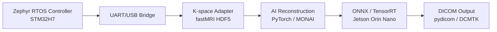

# Architecture

## System Story

The project simulates the software shape of an MRI embedded system without requiring real MRI hardware.

1. The RTOS controller runs a programmable pulse sequence and emits timing/status events.
2. The host bridge maps simulated acquisition output to k-space sample batches.
3. The reconstruction service converts k-space data to an image, runs AI reconstruction, and writes DICOM output.
4. Test and reporting tools record timing, latency, PSNR/SSIM, and static-analysis results.

## Modules



## Design Principles

- Keep real-time control independent from AI reconstruction.
- Prefer C++17 RAII and explicit ownership in host services.
- Keep firmware sequence descriptions small and deterministic.
- Record performance numbers only when measured.
- Treat medical compliance as engineering discipline: traceability, tests, static checks, and clear risk notes.

## Initial Interfaces

Sequence description:

```json
{
  "name": "spin_echo_demo",
  "events": [
    { "t_us": 0, "channel": "rf", "value": 1 },
    { "t_us": 90, "channel": "rf", "value": 0 },
    { "t_us": 120, "channel": "gradient_x", "value": 1 }
  ]
}
```

Inference request:

```text
input: DICOM bytes or normalized k-space tensor
output: reconstructed DICOM bytes and metrics metadata
```

