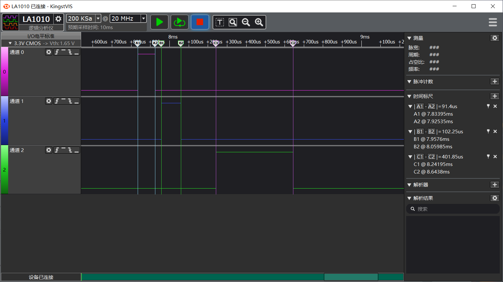

# STM32F407 GPIO Logic Capture Result

Date: 2026-06-27

Instrument: Kingst LA1010 logic analyzer

Firmware mode: Zephyr GPIO auto-wave build

Artifacts:

- Screenshot: [`docs/assets/stm32_gpio_logic_capture_pa9_pd5_pa11.png`](../assets/stm32_gpio_logic_capture_pa9_pd5_pa11.png)
- Raw KingstVIS capture: [`docs/assets/stm32_gpio_logic_capture_pa9_pd5_pa11.kvdat`](../assets/stm32_gpio_logic_capture_pa9_pd5_pa11.kvdat)

Capture settings:

- Logic threshold: 3.3 V CMOS, `Vth = 1.65 V`
- Sample rate: `20 MHz`
- Capture window: `10 ms`
- Trigger/reference: repeated `PA9` rising edge

Signal mapping:

| Analyzer channel | STM32 pin | Sequence channel | Expected pulse width | Measured pulse width |
| --- | --- | --- | --- | --- |
| `CH0` | `PA9` | `rf` | `90 us` | `91.4 us` |
| `CH1` | `PD5` | `gradient_x` | `100 us` | `102.25 us` |
| `CH2` | `PA11` | `adc_gate` | `400 us` | `401.85 us` |

The measured timing is consistent with the intended spin-echo demo schedule. The capture validates that the Zephyr-side event timeline can be represented as deterministic STM32 GPIO timing for hardware inspection. Small differences are expected from software GPIO toggling, analyzer cursor placement, and display quantization.

